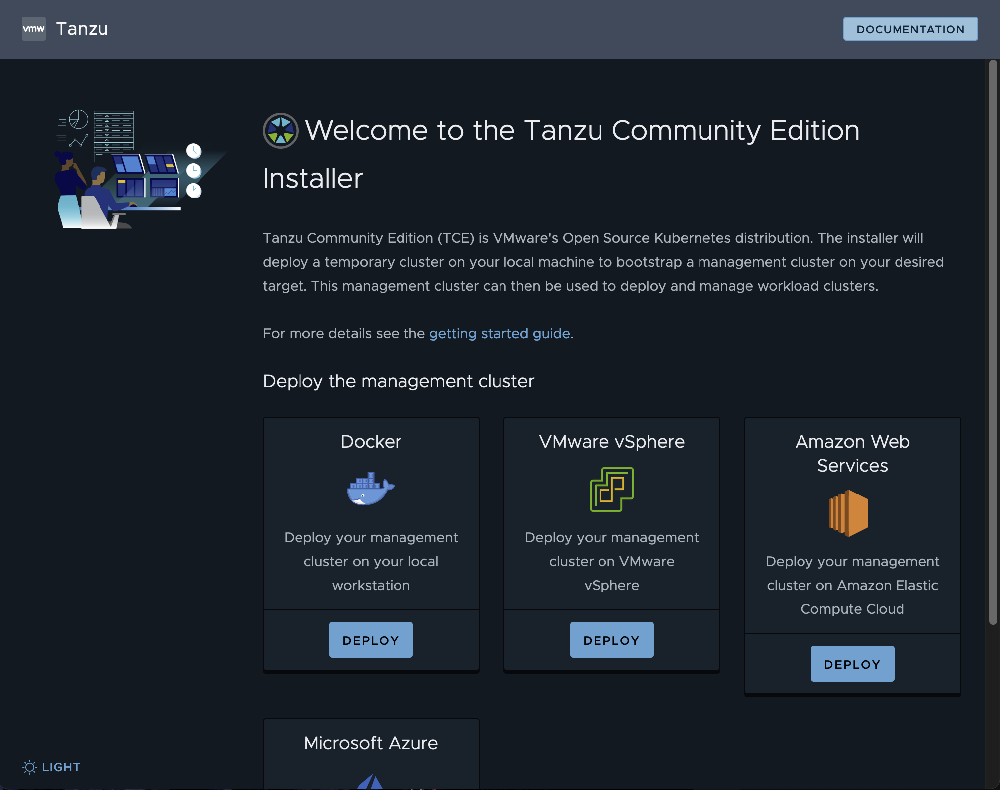

## TKG Bootstrap Machine on Fedora ##

Tanzu Kubernetes Grid needs a workstation to bootstrap your Kubernetes Cluster. This is a short guide for a Fedora based bootstrap Machine:

**Requirements**

- Ability to run Docker
- Access to download Tanzu CLI (via Customer Connect Portal)
- dedicated admin user in the wheel-group

**Install Docker**

Docker on modern RHEL systems can  be confusing because the latest versions of RHEL replace Docker with Podman (dnf install docker will install podman). I should work with podman, but we explicity are going to install Docker Container Engine.

Login to your system (via ssh) with the admin user.

Add Repo and Install Docker CE
```
sudo dnf -y install dnf-plugins-core
sudo dnf config-manager --add-repo https://download.docker.com/linux/fedora/docker-ce.repo
sudo dnf install docker-ce docker-ce-cli containerd.io docker-buildx-plugin docker-compose-plugin
````

Start & enable Docker
```
sudo systemctl start docker && sudo systemctl enable docker
```

Set Docker Socket context to current user. This step is crucial, to allow the current user to access the docker socket.

```
sudo chown $USER:docker /var/run/docker.sock
```

***Install Tanzu CLI and Plugin***

```
cat << EOF | sudo tee /etc/yum.repos.d/tanzu-cli.repo
[tanzu-cli]
name=Tanzu CLI
baseurl=https://storage.googleapis.com/tanzu-cli-os-packages/rpm/tanzu-cli
enabled=1
gpgcheck=1
repo_gpgcheck=1
gpgkey=https://packages.vmware.com/tools/keys/VMWARE-PACKAGING-GPG-RSA-KEY.pub
EOF

sudo dnf install -y tanzu-cli
```

```
tanzu plugin install --group vmware-tkg/default:v2.4.1
```

***Install VMware kubectl***

Go to VMware Customer Connect and Download VMWare kubectl.
https://customerconnect.vmware.com/downloads/get-download?downloadGroup=TKG-241)

Unzip the package and make it executable

```
chmod ugo+x kubectl-linux-v1.27.5+vmware.1
```

Install

```
sudo install kubectl-linux-v1.27.5+vmware.1 /usr/local/bin/kubectl
```


## Test the setup ##

If everything worked you should be able to run the following commands without any issues:

List your Tanzu CLI plugins
```
tanzu plugin list
```

Create a Tanzu Management Cluster to boostrap TKG
```
tanzu management-cluster create --ui
```




## Troubleshooting ##

***Error*** "Docker prerequiries not met"

This is usually the case when the current user does not have access to docker. 
In the current User Session run:

```
docker ps -a
```

If presented with "Got permission denied" try adding current user to the wheel (local admin group) group
```
sudo usermod -aG wheel $USER
```

Then try again to create your tanzu management cluster.

